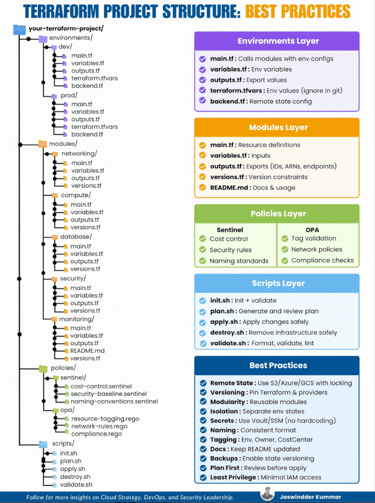

Terraform Project Boilerplate

>*Image source/credits: [https://www.linkedin.com/in/jaswindder-kummar/]*
Project Structure

Image source/credits: Jaswinder Kumar

This script automates the creation of a professional, production-ready Terraform directory structure.

Structure Overview

environments/: Isolated configurations for Dev and Prod.

modules/: Reusable infrastructure components.

policies/: Security and compliance using Sentinel and OPA.

scripts/: Automation wrappers for CI/CD.

Quick Start

Linux / macOS / WSL

curl -sSL [https://raw.githubusercontent.com/FPLescano/tf-structure-generator/main/setup_tf.sh](https://raw.githubusercontent.com/FPLescano/tf-structure-generator/main/setup_tf.sh) | bash

Windows (PowerShell)

iwr [https://raw.githubusercontent.com/FPLescano/tf-structure-generator/main/setup_tf.ps1](https://raw.githubusercontent.com/FPLescano/tf-structure-generator/main/setup_tf.ps1) | iex

License

This project is licensed under the MIT License - see the LICENSE file for details.
